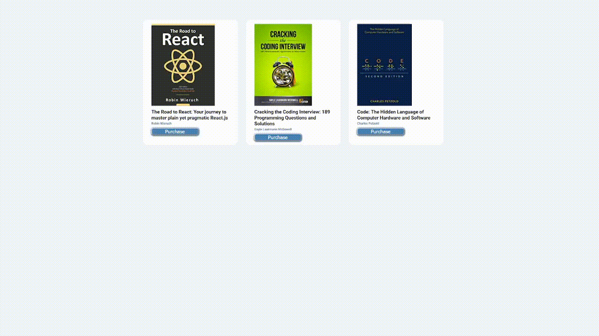

# book-list

Small book list to practice use of components props, prop destructuring and event handling in react

## How It's Made:

**Tech used:**
HTML, CSS, JavaScript, React

**Preview:**

    

## Optimizations:

Current event on click pops up an alert. Would like to come back and add state to a shopping cart icon that updates a badge with number of items in cart.

## Lessons Learned:

Learned a bit more about props and prop destructuring
